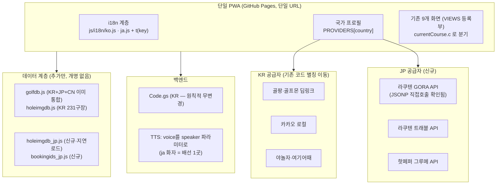

# 투어리스트 글로벌 설계 — 한·일 통합판 v1 (2026-07-31)

> 설계: Fable 5 · 집행: Opus · 승인: 사장님
> 선행 문서: [해외진출_일본중국_조사.md](해외진출_일본중국_조사.md) (일본·중국 플랫폼/구장DB 조사)
> 이 설계는 **코드베이스 전수 조사(9개 영역, 파일:줄 근거) 위에서** 작성했다.
> 중국은 제도 문제(외자 지도 불가·구글 차단)로 **보류** — 파트너 법인이 생기면 별도 설계.

---

## 0. 한 장 요약

**"국가는 데이터다."** 앱을 두 벌 만들지 않는다. `언어(ko/ja)` × `국가(KR/JP)` 두 축을
독립시켜 한 코드베이스가 네 조합을 낸다:

| 조합 | 누구 | 상태 |
|---|---|---|
| ko × KR | 지금의 한국 이용자 | **무변경이 제1원칙** |
| ja × JP | 일본 이용자 (일본 논의 대상) | 신규 |
| **ko × JP** | **한국 골프여행객의 일본 원정** | 신규 — **차별화 핵심** |
| ja × KR | 일본 인바운드 골퍼 | 부수적으로 따라옴 |

ko×JP 가 이 설계의 값어치다. 야놀자도 골팡도 못 주는 **"일본 구장의 예보+빈자리+코스공략을
한국어로"** — 라쿠텐 GORA API(빈자리·요금·제휴 URL)와 우리 코스공략 파이프라인의 결합이고,
TOURLIST 라는 이름(tour+list) 그대로다.
**그리고 골프여행객 조합의 절반은 이미 코드에 있다** — golfdb.js 에 일본 구장 2,014곳이
`c:"JP"` 로 들어 있고(js/golfdb.js, KR 635·JP 2,014·CN 335 실측), 한글→로마자 검색 매칭
(js/app.js:319·374), 국기 표시(app.js:413), 해외 레이더 분기(app.js:1382)까지 구현돼 있다.
이 설계는 무에서 만드는 게 아니라 **이미 있는 반쪽을 마저 채우는 것**이다.

---

## 1. 아키텍처 원칙 — 이 다섯을 어기는 코드는 되돌린다

1. **KR 무변경.** 한국 이용자의 화면·저장값·통계·캐시 키는 1바이트도 달라지지 않는다.
   판정 기준은 "sweep 400조합 무수정 통과 + ko DOM 스냅샷 동일"이다.
2. **값(v)과 라벨(t)은 다른 존재다.** 서버 검증값·엔진 비교값·localStorage 저장값·파서
   토큰은 **절대 번역하지 않는다**. 번역은 라벨만. (근거는 §3-D2 프로토콜 토큰 목록)
3. **파일 개명 금지, 추가만 허용.** `golfdb.js`·`holeimgdb.js` 를 파싱하는 도구가 9종
   (되쓰기 3종 포함)이라 개명은 연쇄 파손이다. 국가 확장은 **새 파일을 옆에 놓는다**.
4. **관문 없는 배포 없음.** 일본 데이터도 한국과 같은 급의 배포 관문(출처·홀수·중복·잔재)을
   먼저 만들고 나서 데이터를 넣는다. 관문은 반드시 "일부러 고장 내서 잡는지" 확인한다.
5. **확인 못 한 것은 만들지 않는다.** GORA 상용조건·아코디아 홀데이터·APPI 약관 등
   미확인 전제(§7) 위에 코드를 쌓지 않는다. 확인 전에는 그 기능만 보류한다.

---

## 2. 시스템 구조



날씨는 국가 불문 Open-Meteo 유지(조사 결과 KR도 수치예보는 전부 Open-Meteo, 기상청은
레이더 GIF 1종뿐 — js/app.js:1571). 시간대만 명시화한다(§3-D4).

---

## 3. 핵심 설계 결정 (D1~D10) — 근거와 함께

### D1. 단일 앱 · 단일 배포 · 2축 상태

- 상태 두 개를 신설: `riweather.lang` (ko|ja) · 국가는 **화면 상태가 아니라 구장 데이터**
  (`currentCourse.c`)에서 나온다. 별도 "국가 모드"를 만들지 않는다 — 검색창에서 일본
  구장을 고르면 그 순간부터 그 구장의 화면이 일본 공급자로 그려지는 것이 전부다.
- 근거: 모든 메뉴가 전역 `currentCourse` 하나를 읽는 구조(app.js:711, 819-857)라
  국가 분기는 `course.c` 데이터 분기가 최소 변경이다. 이미 `isKRCourse()`(app.js:1484-1495),
  통계(stats.js:129-130), 레이더(app.js:1382)가 이 방식으로 분기 중이다.
- `lang` 기본값: `navigator.language` 가 ja* 면 ja, 아니면 ko. 설정에서 변경 가능.
- 기각한 대안: 국가별 별도 빌드/저장소 — sync.py 2PC 워크플로·배포 관문·PWA 설치 사용자
  전부와 충돌. 파트너가 별도 도메인을 원하면 같은 사이트에 도메인만 얹고 hostname 으로
  기본 lang 을 정하는 것으로 충분하다.

### D2. i18n — 런타임 사전 + **프로토콜 토큰 금지 목록** (이 설계의 심장)

- 빌드 도구가 없는 정적 사이트이므로 **런타임 사전**: `js/i18n/ko.js`(원문 사전),
  `js/i18n/ja.js`, 전역 `t(key, params)`. ja 에 없는 키는 **ko 폴백 필수 규약**.
- 조사 실측 규모: 문자열 리터럴 약 2,520개(clubfit 1,516 · app 694), index.html
  텍스트노드 238 + 한글 속성 47(placeholder·aria-label·alt), 서버(Code.gs) 59.
  한국어 조사(을/를·으로)가 문자열에 박혀 있어 **키 단위는 문장**이다(단어 치환 불가).
- **번역 금지 목록(프로토콜 토큰)** — 이걸 어기면 조용히 깨진다. 조사에서 실증된 것:
  | 토큰 | 어디에 값으로 박혀 있나 | 번역하면 |
  |---|---|---|
  | FB 분류 `오류/불편/아이디어/칭찬` | 서버 검증(Code.gs:146·181) + 관리자 CSS | **의견이 재시도 없이 소멸**(stats.js:242) |
  | 브랜드값 `타이틀리스트` 등 | 피팅 엔진 매칭 + sweep 입력(sweep.js:47·150·179) | 피팅 전멸 |
  | 동의·프로필값 `여성`·`60대 이상`·`1년 미만` | 문자열 동치 분기(app.js:2642-2657) + caddieKey(2758) | 캐디 인격화 전멸 + 기존 사용자 localStorage 단절 |
  | 샷 라벨 `티샷/세컨샷/서드샷/그린` | 프롬프트 형식(2832-45)+**파서 정규식(2286)**+SHOT_ICON(2279)+sweep(572-576) | 캐디 카드 파싱 실패 |
  | 통계 region 값(시/도명) | 백엔드 집계 축(stats.js:88-118) | 통계 단절 |
  | localStorage 저장값(`슬라이스`, `전체`, 티 이름) | 상태 복원 비교 | 기존 사용자 설정 증발 |
  처리법: **UI 는 `t()` 라벨로 보여주고, 전송·저장·비교는 캐논 값(현행 한국어) 유지.**
  clubfit 의 chipList 가 이미 v(값)/t(라벨) 분리 구조(clubfit.js:506-508)다 — 이 패턴을 전 앱 표준으로 승격.
- **서버 err 는 코드화**: Code.gs err 문자열이 화면에 그대로 뜨는 경로 3곳
  (app.js:5226·5319·5445). `"limit"` 코드 전례(Code.gs:204)를 따라 err 를 코드로 바꾸고
  클라가 `t()` 로 표시. 구버전 호환: 앱에 일반 폴백이 이미 있음(app.js:5445).
- 추출 순서(작은 파일 → 큰 파일, 화면당 1커밋):
  `booking.js(42) → stay.js(55) → loading.js(35, 이미 배열) → stats.js(노출분만) →
  legal.js(키 구조화) → index.html 속성 47 → app.js 를 VIEWS 9화면 순 → clubfit.js 최후`.

### D3. 데이터 — 개명 없이 옆에 놓기

- **golfdb.js 는 손대지 않는다.** 일본 구장 2,014곳이 이미 안에 있다. 분리하면
  `const GOLF_DB = [...]` 단일 배열을 정규식/슬라이스로 파싱하는 도구 9종이 깨진다
  (match_dbnames, export 2종, golfzon_build, gz_link_kakao·link_gz_unmatched 는
  **되쓰기까지 함**, expand_golfdb, build_booking_ids:57 index~rindex 슬라이스,
  find_missing_homepages). **KR 기존 항목 (n,lat,lon,c) 바이트 불변**을 관문으로 강제(§4-G6).
- **일본 홀맵은 신규 파일** `js/holeimgdb_jp.js` (`const HOLEIMG_DB_JP`) — 재선언
  SyntaxError 원천 차단, 국가 간 이름 충돌 원천 차단. 소비부는 조회 헬퍼 하나로 통일:
  ```js
  function holemapOf(course){          // app.js:1881, booking.js:132-138 이 이걸 쓰도록
    return (course.c === "JP" ? (typeof HOLEIMG_DB_JP !== "undefined" ? HOLEIMG_DB_JP : {}) 
                              : HOLEIMG_DB)[course.name];
  }
  ```
- **지연 로드**: holeimgdb_jp.js 는 index.html `<script>` 에 넣지 않고, 일본 구장을 처음
  열 때 동적 삽입. 이유: KR 이용자에게 JP 데이터 전송 0바이트, sw.js CORE(addAll — 1개
  404 면 설치 전체 실패, sw.js:29-32 주석의 실사고 전례)도 건드리지 않음.
  ⚠️ 지연 로드는 배포 관문의 사각지대다 — §4-G2 LAZY_FILES 관문을 **먼저** 만든다.
- **일본 홀맵 원본(SVG)은 `holeimg/jp_{구장}/`** — 기존 stage 목록(release_courses.py:106-109)·
  sync 자동해결 prefix(sync.py:164-167)·.gitignore 규칙을 그대로 상속받는 위치.
  새 최상위 폴더는 만들지 않는다. SVG는 텍스트라 용량 부담이 작지만(PGM 실측 홀당 수십 KB),
  **등록 구장만 단계적으로 담는다**(구장 등록 완전성 원칙과 동일). 저장소 팩이 이미 885MB 라
  전량 선탑재는 금지.
- 일본 내 중복 구장명(golfdb 에 n 중복 15건 실존): build 단계에서 **중복 키 발견 시 exit 1**
  을 관문으로 승격(§4-G5). 필요 시 구장명에 현(県) 접미로 구분해 등록.

### D4. 공급자(PROVIDERS) — KR 은 "별칭 이동"만

- `js/providers.js` 신설: `PROVIDERS = { KR:{...}, JP:{...} }`. 인터페이스는 조사가 뽑은
  소비부 정규형 그대로(booking 카드 `{key,img|ico,cls,title,sub,url}` = booking.js:167-192,
  숙박 항목 `{id,name,cat,kind,...}` = stay.js:100-110, 맛집 동형 = app.js:3087-3095).
- **KR 공급자는 기존 함수의 참조를 넣을 뿐, 기존 전역을 없애지 않는다.**
  sweep 이 전역명을 그대로 호출한다(golfpangUrl, bookingLinkCards, fetchKakaoStay …
  sweep.js:374-513). `PROVIDERS.KR.booking.linkCards = bookingLinkCards` 식 별칭 —
  **"sweep 무수정 통과"가 KR 동작 무변경의 판정 기준**이다.
- JP 공급자:
  | 기능 | 구현 | 근거 |
  |---|---|---|
  | 부킹/조인 | **1차: GORA 딥링크**(reserveCalUrl·golfCourseDetailUrl) + `bookingids_jp.js`(GORA golfCourseId 매핑) / **2차: 플랜검색 API 로 빈자리·최저가 표시** | JSONP(callback) 지원 실측 확인 — 브라우저 직접 호출 가능. 429 대비 클라 캐시(bkweek 패턴 재사용) |
  | 숙박 | 라쿠텐 트래블 API(제휴 URL) — **현행 버전만**(레거시 2026-02 폐지됨) | 조사문서 §2 |
  | 맛집 | 핫페퍼 그루메 API + **크레딧 표기**(이미지/텍스트 의무) | 이용조건 실측 |
  | 내비 | 구글맵 URL(`https://www.google.com/maps/dir/?api=1&destination=`) — 앱 스킴 4곳(app.js:1005·3547·3578, stay.js:331)을 NavProvider 로 | kakaomap:// 는 일본에서 무의미 |
  | 날씨 | Open-Meteo 유지 + **timezone 을 `Asia/Seoul` 하드코딩 6곳**(app.js:170·183·236·492·4499, booking.js:30)에서 `course.c` 기반 `Asia/Tokyo` 로 명시화. JST=KST(UTC+9)라 지금도 우연히 맞지만 우연에 기대지 않는다 | 조사 실측 |
  | 검색 | Nominatim `accept-language`·`countrycodes` (app.js:249-251·285) lang/국가 연동 | 〃 |
- GORA `applicationId`/`affiliateId` 는 카카오 키와 같은 방식(공용 키 내장 — 라쿠텐 웹서비스는
  클라이언트 사용 전제 설계)으로 시작하되, **발급·약관 확인은 사장님 몫**(§7).
  ⚠️ GORA 좌표는 **일본측지계(Tokyo Datum)** — WGS84 변환 없이 쓰면 수백 m 어긋난다.
  golfdb 의 기존 JP 좌표는 OSM(WGS84)이므로 **GORA 좌표는 매핑 검산용으로만** 쓰고 표시 좌표는 golfdb 를 유지.

### D5. 일본 구장 데이터 파이프라인 — `tools/jp/` 신설 (KR 파이프라인 무접촉)

- 수집: `tools/jp/pgm_collect.py` + `tools/jp/accordia_collect.py`.
  **2026-07-31 Phase 0 실측으로 확정된 사실**(설계 초안의 추정을 아래로 대체):

  🔴 **2026-07-31 2차 실측으로 아래 표를 전면 교체했다. 1차 조사의 두 가지가 틀렸다.**

  **정정 ①: PGM 에 홀맵 그림은 없다.** 1차에서 "SVG 홀맵"이라고 본 `/{슬러그}/assets/img/course/{n}.svg`
  는 **575바이트짜리 홀 번호 배지 아이콘**(원 안에 숫자)이었다. 실제 홀 그림이 아니다.
  PGM 예약 사이트의 홀 그림 자리는 **전 구장 `noimage.jpg` 플레이스홀더**다.
  → PGM 은 **'수치 전용 출처'로 재분류**한다(홀별 파·HDCP·티별 야드는 134구장 전부 있다).

  **정정 ②: PGM `sitemap.xml` 을 인덱스로 쓰면 안 된다.** 슬러그 21개뿐이라 전체 134곳의
  **87%를 놓친다.** 인덱스는 `www.pacificgolf.co.jp/course/` 의 `guide/(\d+).html`.

### 🔴 D5-1. 핵심 발견 — 문제를 **수치**와 **그림** 두 층으로 쪼개야 한다

| 층 | 내용 | 도달 가능 | 1,000곳? |
|---|---|---|---|
| **L1 수치** | 홀번호·파·HDCP·티별 야드 | **1,900~2,000곳** (じゃらんゴルフ 하나로) | ✅ **초과 달성** |
| **L2 홀맵 그림** | 홀별 레이아웃 이미지 | 확정 **193곳** · 현실 상한 400~430곳(추정) | ❌ **크롤링으로는 불가** |
| **L3 공략문** | 홀별 공략 텍스트 | 실측 **9곳**(東京建物)뿐 | ❌ 자체 생성 필요 |

**홀맵 그림 확정 193곳** (전부 실측·robots 허용):
아코디아 **169** · 東急ゴルフリゾート **12** · 東京建物리조트 **9**(공략문까지 있음) · 多摩興産 **3**.
아코디아 홀맵 실측: `reserve.accordiagolf.com/images/course/092/courseLayout/1_1.jpg`
→ HTTP 200 · `image/pjpeg` · **299,753바이트** (실제 이미지 확보 확인).
⚠️ 호스트는 반드시 `reserve` — `www` 는 200 응답의 1,465B **HTML 오류 페이지**(조용한 실패).
수집 시 **Content-Type 이 image 인지 반드시 검증**할 것.

**수치 출처 (L1)**

| 출처 | 곳수 | 티 | robots |
|---|---|---|---|
| **じゃらんゴルフ** `/gc{5자리}/detail/` | **1,900~2,000** | 3티 | 허용 |
| ShotNavi `gcinfo_{id}.htm` | ~2,110 | 3티 | 허용(수치 페이지만) |
| PGM `booking…?p=guide.course_layout&cc_id=` | 134 | **4~5티** | 전면 허용 |
| 아코디아 `/layout` | 169 | 4티 | 허용 |
| 太平洋クラブ | 17 | **6티** | robots 404 |

→ **じゃらん 으로 골격 1,900곳을 깔고, 티가 많은 출처로 덮어쓰기(upsert)** 하는 구조.

**🚫 손대면 안 되는 출처 (실측)**
- **ShotNavi 홀맵** `/gcguide/cdata/` — robots.txt **명시적 Disallow**. 자사 GPS 기기의 핵심 상품 DB다.
  **크롤링 금지. 라이선스 협상만이 경로** (계약 1건 = 약 2,400코스 — 크롤링 400곳을 압도한다).
- **GDO** `reserve.golfdigest.co.jp` · **ALBA** `book.alba.co.jp` — robots.txt 조차 **HTTP 403**.
  자동수집 거부 의사표시다. **우회 금지.**

**결론:** 홀맵 그림 1,000곳은 크롤링으로 **불가능하다.** 갈 길은 셋 —
① 확보 가능한 400곳으로 시작 ② **수치로 홀맵을 직접 작도**(1,900곳 가능) ③ ShotNavi 라이선스.

  - ⚠️ `course_plain.asp` 는 표준이 아니다 — 남이치하라만 그렇고 마리아는 404다.
  - ⚠️ PGM 슬러그 표기 주의 — 소부는 `sobu` 가 아니라 **`sohbu`**.
  - ⚠️ PGM `cc_id` 는 **결번도 HTTP 200 을 반환**한다. `<title>` 의 구장명이 비었는지로만 판별 가능.
  - **공략문은 '있으면 넣고 없으면 비운다'.** 없는 구장에 지어 넣지 않는다(원칙 5).
    아코디아는 전부 없으므로 홀맵+거리만으로 AI 캐디를 돌린다 — 한국의 위성 추정 구장과
    달리 **파·거리가 공식 실측이므로 캐디를 내보내도 되는 조건은 충족**한다.
    東京建物 9곳의 공략문은 **명백한 어문저작물이라 복제 금지** — 참고만 하고 자체 작성한다.
- **A/B 그린 이중 야드**: A그린(주 그린) 기준으로 등록하고 parsed.json 에 `green:"A"` 명기.
  B그린 병기는 화면이 감당 못 하므로 1차 제외 — 지어내지 않고 한쪽을 명시하는 것.
  (실측: PGM 소세이·아코디아 소부가 2그린. 아코디아는 A/B 야드가 **2세트로 따로** 나온다)
- 조립: `tools/jp/build_holeimgdb_jp.py` → `js/holeimgdb_jp.js`.
  **KR 의 build_holeimgdb.py 는 1줄도 안 고친다** — JP parsed 오류가 KR 배포를 인질로
  잡는 구조(현행: 전 구장 일괄 재조립 exit1, release_courses.py:38-49)를 원천 회피.
- 관문: `tools/jp/check_sources_jp.py` (SITE_NAME_JP 도메인표 — pacificgolf.co.jp 등),
  홀수 대조원은 **PGM 공식 페이지의 홀 수**, 중복 키 exit1, SVG 실재, 티 내림차순
  (check_tees 로직 재사용 — 일본어 티 라벨을 LADDER 에 추가).
  release_courses.py 에는 **JP 관문 블록을 독립 추가**(KR 관문 실패≠JP 관문 실패).
- 홀맵 표준화: SVG → 세로600 PNG 변환(기존 standardize_holemaps.py 계열 재사용)
  또는 SVG 직접 표시(요소 렌더 실측 후 결정 — SVG 그대로면 선명도 이득).
- **일본판 내리기 스위치** — golfzon_takedown.py 와 동일 설계
  (source 표기 기준 탐지·zip 백업 대조·복구·리허설). **데이터를 넣기 전에 스위치부터 만든다.**
  ✅ *7/31 `tools/jp_takedown.py` 로 완성(설계 경로 tools/jp/ 가 아님에 주의 — 8/1 검토 확인).
  자료 폴더는 `coursedata/homepages_jp/{구장}/parsed.json`, 출처 표기는 스위치의 SOURCES 표와 일치 필수.*
  권리자 통지가 아니라 **협상 카드**다: 일본 논의에서 정식 허락을 받으면 스위치는 보험이 된다.

### D6. AI 캐디·음성 ja

- 프롬프트: `caddiePrompt(lang)` 분리. 한국어 원문(app.js:2813-2845)은 바이트 불변 유지.
  일본어 프롬프트는 **번역이 아니라 재작성** — ですます調, 스코어 호칭 금지 원칙 이식
  (한국어 v167 "싱글 외 타수 호칭 금지"의 일본 예절판), 그린 색깔 언급 금지 동일 적용.
  ⚠️ 예시문 호칭은 모델이 그대로 베낀다(v167 실사고) — ja 예시문도 중립 호칭으로.
  **일본어 네이티브(일본 논의 상대) 검수 전에는 베타 배포 금지.**
- 샷 라벨: ID 간접화(`shot.tee/second/third/green`) — 표시·프롬프트 형식·파서 정규식이
  같은 사전 항목을 공급받도록. 파서(2286)가 라벨 정규식이므로 **lang 별 라벨 세트**로 생성.
- 캐디 캐시 키(caddieKey, app.js:2758)에 **lang 추가** — ko 캐시가 ja 화면에 나오는 사고 방지.
- TTS 서버 (**2026-07-31 Phase 0 실측으로 초안 수정**):
  - ja-JP Chirp3-HD 는 **실존**하고 GA다. 화자는 `ja-JP-Chirp3-HD-Kore` 권장
    (한국이 쓰는 Kore 와 같은 캐릭터라 로케일 간 캐디 톤이 일관됨. 여성).
  - 초안의 "voice 명을 speaker 로 그대로 넘기면 끝" 은 **절반만 맞다.**
    캐시 키에 speaker 가 이미 들어 있어(Code.gs:413-415) **캐시 분리는 자동으로 된다** — 여기까지는 맞다.
    그러나 `tts_()` 가 speaker 를 **클로바에만 넘기고 구글엔 안 넘긴다**(Code.gs:419).
    고칠 곳은 **4군데**: 419(인자 전달) · 432(시그니처) · 435(voices 배열) · 445(languageCode).
  - 🔴 **가장 위험한 함정 — 폴백이 조용히 한국어로 샌다.** Chirp3-HD 가 요청을 거부하면
    `voices[1]` 로 물러나는데 그게 `ko-KR-Neural2-A` 고정이고 languageCode 도 `"ko-KR"` 고정이다.
    화자만 ja 로 바꾸면 **일본어 문장을 한국어 음성으로 읽는 실패가 오류 없이 200 으로 나온다.**
    → voice 명에서 로케일을 파생시키고 폴백도 같은 로케일로(ja 폴백은 `ja-JP-Neural2-B`).
  - ⚠️ 기본값 `"nara"` 는 **클로바 화자명**이다(Code.gs:407). speaker 를 '구글 voice 명'으로
    재해석하는 순간 `"nara"` 가 voice 자리로 들어가므로 **형식 가드**(정규식으로 확인 후
    아니면 기본 voice)가 필수다.
  - ⚠️ 앱의 `ttsMemo`(app.js:2403)는 **text 만 키로 쓴다** — 같은 문장에서 화자만 바꾸면
    옛 음성이 그대로 재생된다. `TTS_SPEAKER`(app.js:2385)를 언어별로 분기할 때 같이 볼 것.
  - 배포 전 1회 실호출 확인 권장: Apps Script 편집기에서 `voices?languageCode=ja-JP` 를
    임시 함수로 호출해 Kore 존재만 눈으로 확인(키가 스크립트 속성에만 있어 저장소에선 확인 불가).
  - Code.gs 개정은 **사장님 재배포 1회에 몰아서**(§5 Phase 7) — 재배포는 병목 자원이다.
- 기기 폴백: `pickKoVoice`(app.js:2327) → `pickVoice(lang)`. u.lang 기본값(2464),
  문장 분할에 `。`(2444), speechText 의 `(\d)m→미터` 치환(2368)을 lang 분기.
  ja 음성이 없는 기기는 한국과 같은 원칙 — **버튼을 조용히 숨긴다**(어색한 발음으로 읽지 않는다).

### D7. 백엔드 — KR Code.gs 는 성역, JP 는 옆에

- 통계: region() 은 이미 JP→"일본" 처리(stats.js:129) — KR 축 무변경. JP 를
  도도부현으로 세분: 주소에서 `都|道|府|県` 접미 토큰 추출, 실패 시 "일본" 폴백.
  **값은 일본어 지명 그대로 저장**(캐논 값 신설이지 번역이 아님). ops 화면은 그대로 표시됨.
- FB 분류: 전송값 한국어 캐논 유지(D2), ja UI 라벨만 일본어. 시트·관리자·메일 무변경.
- 약관: LEGAL_DOCS 에 lang 차원 추가 + openDoc 분기(app.js:4856-4863) —
  **LEGAL_VERSION 유지로 기존 사용자 재동의 안 뜸**(동치 비교뿐임을 실측 확인, app.js:4816).
  ⚠️ **ja 약관 본문은 APPI 법률 확인 전에 배포하지 않는다**(§7). 좌표 미수집 원칙은
  APPI 에서도 유리하게 작용 — 이 원칙을 ja 약관에도 명문화.
- GORA 프록시가 필요해지면(JSONP 불충분 판명 시) **별도 Apps Script 프로젝트**
  (`RIW_BACKEND_JP`) — KR 백엔드의 수동 재배포 병목·UrlFetch 쿼터를 공유하지 않는다.

### D8. 브랜드·매니페스트

- manifest name: **"투어리스트 TOURLIST" 병기** — sweep(document.title 에 `투어리스트`
  요구, sweep.js:661)·한국 상표·기존 설치 사용자와 충돌이 가장 적은 안.
  manifest **파일명 개명 금지**(sw.js CORE:24·verify_deploy:38·index.html:10 3곳 참조).
- `<html lang>` 동적 전환 + `html[lang="ja"]` 폰트 스택
  (`Hiragino Kaku Gothic ProN, Yu Gothic UI, Meiryo`) — 현 스택은 Malgun Gothic 이
  앞서 있어 **일본어가 한국식 한자 자형으로 렌더**된다(css/style.css:59-60).
- ja 문장 길이: nowrap+ellipsis 지점(style.css:1387·2570·2618)과 `.bk-dow`
  (10.5px·자간 -0.03em, kana 부적합) — ja sweep 의 넘침 검사(§4-G4)로 잡는다.
- 단위: **구장의 원단위 그대로 표시**(KR=m, JP=yd). 환산해서 보여주지 않는다 —
  일본 구장 표지판이 야드인데 미터로 읽어주면 캐디가 틀린 앱이 된다.
  parsed_jp 에 `unit:"yd"`, 표기(app.js:2104-2111)·캐디 프롬프트 facts(2821-2823)·
  거리 링(2231)·프롬프트 head "거리선"(2816)이 이 필드를 따른다.
  클럽피팅 입력(m 슬라이더, clubfit.js:721·890)은 **엔진·저장은 미터 유지**,
  ja 표시층만 야드 레인지(110-210/165-305yd)로 받고 환산 저장 — 엔진 임계값·400조합 검증 무변경.
- 날짜: DAY_NAMES/WEEKDAYS(app.js:74-77)·fmtHourKo(81-86, 午前/午後)·bkDayLabel
  (booking.js:37-42, "火 8/4")·통화(stay.js:151 won() → fmtPrice(n,cur), JP 숙박은 ¥) 사전화.
- 공유 문구·스코어카드 캔버스 워터마크(app.js:2911-2920·4672-4676)는 DOM 밖 —
  추출 목록에 명시 포함(DOM 게이트가 못 잡는 지점).
- `naming.html`(옛 골프라이프 브랜드 후보 페이지, 배포 루트에 공개 서빙 중) 제거.

### D9. 검색 유입 전략 (사장님 결정 필요)

robots.txt 가 전 봇 차단(`Disallow: /`) 상태 — 일본 신규 시장 진입과 정면 충돌.
일본 베타 시작 시점에 최소 ja 페이지만 허용할지, 전면 유지할지 **사장님 결정 항목**.

### D10. MY스코어·기타 접점

- 스코어보드 OCR(Gemini): 프롬프트가 한국어+한국 티 명칭 고정(app.js:3909-3917) —
  ja 프롬프트 + 일본 카트/GDO 카드 형식은 **실물 샘플 확보 후** 별도 작업(1차 범위 제외, 화면에 "준비중").
- 홀 3D 영상: JP 는 영상 축이 없음 — 버튼 자연 미표시(기존 조건부 렌더 그대로).
  *단, 유튜브 공략영상(`구장영상_설계.md`)이 이 빈자리를 메운다 — 일본은 홀 단위 공략 채널이
  실재(つっちーのPARゴルフ). 한국판 구현(투어리스트_2 창)이 착지한 뒤 같은 도구를 JP 로 확장(8/1).*
- 백업/복구(fn=backup): JP 구장이 담긴 백업 복원 시 지연 로드가 아직 안 된 상태에서도
  구장 목록이 떠야 함 — 복원 직후 JP 항목 존재 시 holeimgdb_jp 로드 트리거 1줄.

---

## 4. 신설 검증 게이트 — 코드보다 먼저 만든다

기존 문화(일부러 고장 내서 잡는지 확인) 그대로. **각 게이트는 도입 시 반드시 고장 검증.**

> ✅ **G1·G2·G3·G5·G6·G7 은 2026-07-31 에 만들어 전부 고장 검증까지 마쳤다**(Phase 1 완료).
> 실행법과 실측 결과는 §5 Phase 1 아래에. G4·G8·G9 는 각각 Phase 3·3·5 에서 만든다.

| # | 게이트 | 무엇을 잡나 | 어디에 |
|---|---|---|---|
| G1 | **sw.js CORE 실검사** — CORE 배열 파싱→각 항목 HTTP 200+내용 | CORE 404 → 전 사용자 SW 설치 침묵 실패(최고위험 S1). 현재 이 대조가 어디에도 없음 | verify_deploy.py 확장 |
| G2 | **LAZY_FILES 관문** — 지연 로드 파일 목록 상수를 release 가 git ls-files·HTTP 200 검사에 합류 | 지연 로드는 index.html src 정규식 관문(release:145, verify:36)의 사각 — legal.js 404 사고 재발 경로 | release_courses.py |
| G3 | **ko DOM 스냅샷 동일** — playwright 러너(Date 고정+픽스처 fetch), 뷰별 innerText + **속성 47개 + document.title + alert 후킹** | i18n 추출 중 ko 화면 변형. 텍스트노드만으론 불충분(속성·다이얼로그가 사각) | 신규 tools/i18n_snapshot.js |
| G4 | **ja sweep** — ①MutationObserver 로 세션 내 [가-힣] 텍스트 감시 ②뷰별 innerText+속성 스캔 ③넘침 검사(scrollWidth 전례 sweep.js:544 일반화) ④i18n 키 노출 검사 | ja 모드 한글 잔재·번역 누락·버튼 넘침 | sweep lang 파라미터화 |
| G5 | **중복 키 exit1** — build_holeimgdb(_jp) 에서 중복 구장명 시 배포 중단 | 이름 키 객체의 조용한 덮어쓰기(JP 동명 15건 실존) | build 도구 승격 |
| G6 | **golfdb KR 불변 diff** — 작업 전후 KR 항목 (n,lat,lon,c) 0건 diff | 좌표 1비트 변경 → 저장 구장 재식별(app.js:1489)·캐시 키 조용한 파손 | 신규 일회성+관문 |
| G7 | **sweep MUST 보강** — GOLF_DB·HOLEIMG_DB(+_JP)·CLUBDB 전역 + **건수 하한**(GOLF_DB≥2900, KR≥635) | 데이터 파일 문법오류·반토막 로드(현재 sweep 이 데이터 전역을 전혀 안 봄) | sweep.js MUST |
| G8 | **check_hangul.py** — ja 사전·manifest·Code.gs err 경로 정적 스캔(check_brand 복제) | 배포 전 ja 잔재 | 신규, release 관문 |
| G9 | **JP 데이터 관문 세트** — 출처(SITE_NAME_JP)·홀수(PGM 대조)·SVG 실재·티 내림차순 | 일본판 오등록(그린골프클럽 사고의 일본 재발 방지 — 현재 JP 는 무검증 통과) | tools/jp/ |

---## 5. 실행 로드맵 — Opus 집행용

원칙: **샘플 검증 → 본실행**(작업 방식 확정 원칙). 각 Phase 는 독립 배포 가능하고
실패 시 그 Phase 만 되돌린다. **Phase 1~2 진행 중에는 vm(클라우드) 세션·다른 창에서
같은 파일을 만지지 않는다** — sync.py `--start` 로 작업 선언 후 시작.

### Phase 0 — 선행 확인 (개발과 병행, 배포 전 완결 필수)
| 항목 | 누가 | 상태 |
|---|---|---|
| GORA API 상용 이용조건·affiliateId 발급 (라쿠텐 문의) | 사장님 | ⬜ |
| **라쿠텐 applicationId 발급** (GORA·트래블 공용 — 숙박 메뉴의 전제) | 사장님 | ⬜ *8/1 검토에서 추가* |
| **핫페퍼 그루메 API 키 발급** (리크루트 웹서비스, 무료 — 맛집 메뉴의 전제) | 사장님 | ⬜ *8/1 검토에서 추가* |
| YouTube Data API 키 (한·일 공용 — `구장영상_설계.md` §8) | 사장님 | ⬜ |
| PGM/아코디아 홀맵 이용 허락 — **일본 논의 협상 카드로 상정** | 사장님 | ⬜ |
| TOURLIST 일본 상표 검색·출원 (저장소에 흔적 없음 = 미진행 추정) | 사장님 | ⬜ |
| ja 약관 APPI 법률 확인 | 사장님+전문가 | ⬜ |
| 아코디아 홀 데이터 유무 실측 | Opus | ✅ 7/31 — **수집 가능**, D5 표 참조 |
| ja-JP Chirp3-HD 화자명 실존 확인 | Opus | ✅ 7/31 — **실존**, D6 참조 |

### ✅ Phase 1 — 안전망 (2026-07-31 완료, 사용자 화면 무변경)

만든 것과 **고장 검증 결과**(전부 일부러 고장 내서 잡히는 것까지 확인):

| 게이트 | 파일 | 고장 검증 |
|---|---|---|
| G1 sw.js CORE 실검사 | `verify_deploy.py` | CORE 에 없는 파일 추가 → 잡음. *오탐 1건 발견·수정: index.html 은 원래 HTML 이라 404 판별에서 제외* |
| G2 LAZY_FILES 관문 | `js/app.js` 등록부 + `release_courses.py` + `verify_deploy.py` | 없는 파일 등록 → 저장소·실서버 양쪽에서 잡음 |
| G3 ko 화면 스냅샷 | **신규** `tools/i18n_snapshot.js` | 문구 1곳 변경 → 몇 자째부터 다른지까지 지목. 재현성 3회 확인 |
| G5 중복 구장명 차단 | `build_holeimgdb.py` | 같은 이름 2건 → 조립 중단(파일 미변경) |
| G6 golfdb 한국분 불변 | **신규** `tools/check_golfdb_kr.py` (+기준표) | 좌표 반올림 → 잡음 |
| G7 sweep 데이터 전역·건수 | `sweep.js` | 반토막(2,984→155) → 잡음 / 문법 오류 → 잡음 |
| (부수) sweep 명령줄 실행 | **신규** `tools/run_sweep.js` | 창이 안 보이면 크롬이 타이머를 늦춰 sweep 이 멈춘 듯 느려지던 문제 해소 — **46초 고정** |

```bash
node tools/run_sweep.js && node tools/i18n_snapshot.js && python tools/verify_deploy.py
```

실측 결과: sweep **400조합·런타임오류 0·버그 0** / ko 스냅샷 **화면 9개 동일** / verify_deploy 통과.

**G3 을 만들며 겪은 것 — 다음 사람이 또 만난다**
- 픽스처 재생은 **실제 네트워크보다 빨라서** 같은 대기 시간에 화면이 더 멀리 진행된다.
  food·stay 가 실행마다 달랐다 → 요청이 멎을 때까지 기다리는 방식으로 바꿔 해결.
- 바깥 **그림은 아예 차단**한다. 우리가 보는 건 글자인데 사진 수십 장이 흔들림의 주범이었다
  (픽스처도 7.9MB → 399KB 로 줄었다).
- `alt` 속성은 스냅샷 대상에서 뺐다 — 대부분 '가게 이름' 같은 **데이터**라 매번 다르다.
  index.html 에 박힌 정적 alt 6개는 정적 검사(G8) 몫으로 넘긴다.
- ⚠️ 스냅샷은 **그 화면에 실제로 뜬 글자만** 본다. 조건부로만 나오는 문구
  (`bookingDayNote` 의 다른 분기 등)는 못 잡는다 — 고장 검증 때 실제로 겪었다.
  Phase 2 에서 문구를 옮길 때 **스냅샷 통과 = 전부 안전** 으로 읽으면 안 된다.

⚠️ **Phase 1 은 버전을 올리지 않았다**(배포는 다른 창에서 진행). 다음 배포에 함께 나간다.

### Phase 2 — i18n ko 추출 (사용자 화면 무변경이 목표)
D2 순서로 화면당 1커밋. 커밋마다 G3 스냅샷 동일 + sweep 무수정 통과.
프로토콜 토큰 금지 목록을 `docs/i18n_규칙.md` 로 명문화 후 시작. 서버 err 코드화 포함
(Code.gs 개정분은 Phase 7 재배포에 합류, 그때까지 앱은 신구 양쪽 호환).
완료 기준: `js/i18n/ko.js` 로 전 문자열 이동, ko 화면 스냅샷 완전 동일, 배포+실서버 확인.

### Phase 3 — ja 언어팩
ja.js 작성(문장 재작성 수준), html lang 전환+ja 폰트 스택, G4 ja sweep, G8.
날짜·통화·단위 포맷 분기(D8). **네이티브 검수 전 공개 금지** — lang 전환 UI 는
개발 플래그(`?lang=ja`) 뒤에 숨긴다.
완료 기준: ja 모드 G4 통과(한글 잔재 0·넘침 0) + ko 모드 스냅샷 여전히 동일.

### Phase 4 — PROVIDERS 추상화 (KR 별칭 이동)
D4. timezone 명시화·Nominatim lang 연동 포함.
완료 기준: **sweep 을 한 글자도 안 고치고 400조합 통과**(별칭 유지 판정 기준) + KR 실서버 확인.

### Phase 5 — JP 구장 데이터 (선 스위치, 후 데이터)

> 🔴 **8/1 검토 정정 — 샘플·본수집 대상을 PGM → 아코디아로 교체.**
> 이 문단의 옛 판은 D5-1 정정(PGM 홀맵 그림 없음) 전에 쓰인 것이라 자기모순이었다.
> 코스공략 화면은 홀맵 **그림**이 있어야 성립하므로, 그림+수치가 둘 다 있는 **아코디아 169곳**이
> 샘플·본수집의 첫 대상이다. PGM 134곳은 **수치 전용 출처**로서 じゃらん 골격 위 upsert 에만 쓴다.
> 또 스위치는 설계 경로(tools/jp/pgm_takedown.py)가 아니라 **`tools/jp_takedown.py` 로 이미 완성**됐다
> (출처별 선택 내리기·가짜 자료 리허설 검증까지, 7/31). 수집기의 parsed.json `source` 표기는
> 이 스위치의 SOURCES 표(アコーディア/東急/東京建物/多摩興産/PGM)와 **반드시 일치**시킬 것.

① ~~스위치~~ ✅ `tools/jp_takedown.py` 완성 + G9 관문 먼저(고장 검증 포함)
② **아코디아 3구장 샘플** 수집→조립→지연 로드→앱 표시→ko×JP 화면 사장님 검수
③ 본수집: 아코디아 169 → 東急 12·東京建物 9·多摩興産 3 → じゃらん 수치 골격(1,900곳)+PGM 수치 upsert
④ bookingids_jp(GORA golfCourseId 매핑, 좌표 검산은 측지계 변환 후).
완료 기준: JP 등록 구장 코스공략 표시 + KR 배포 관문과 완전 독립 확인.
메뉴별 상세 규격(출처 URL·파싱·링크·관문)은 **`docs/일본_6메뉴_데이터_설계.md`** 로 분리(8/1).

### Phase 6 — JP 공급자 연동
GORA 딥링크/플랜검색(JSONP), 라쿠텐 트래블, 핫페퍼(크레딧 표기), 구글맵 내비.
Phase 0 의 약관 확인이 미완이면 **해당 공급자만 보류**하고 나머지 진행.
완료 기준: ko×JP 이용 흐름(검색→예보→부킹 카드→숙박·맛집) 실기기 확인.

### Phase 7 — ja 캐디·음성 + 백엔드 1회 재배포
D6·D7. Code.gs 개정(err 코드화+TTS voice 파라미터+ja 약관 lang 차원)을 **한 번에 몰아**
사장님 재배포 1회. verify_backend 에 ja 케이스 추가. 실기기(아이폰·안드로이드) 음성 확인.
완료 기준: ja 캐디 네이티브 검수 통과, `lang 미지정 요청 응답 = 현행과 동일` 회귀 확인.

### Phase 8 — 일본 베타 준비
manifest 병기(D8, sweep 정규식과 한 커밋), ops 관리자 JP 축(도도부현), robots 결정 반영(D9),
백업 복원 JP 검증(D10), naming.html 제거, HANDOFF 일본판 운영 절차 기록.

---

## 6. 리스크 등록부 (상위 8)

| # | 리스크 | 대응 |
|---|---|---|
| R1 | sw.js CORE 404 → 전 사용자 업데이트 침묵 정지 | G1 + JP 파일은 CORE 에 안 넣음(런타임 캐시로 충분) |
| R2 | 프로토콜 토큰 오번역 → 의견 소멸·피팅 전멸·사용자 데이터 단절 | D2 금지 목록 + G3/G4 + 코드리뷰 체크항목 |
| R3 | 지연 로드 파일이 배포 관문 사각 → legal.js 404 사고 재발형 | G2 |
| R4 | JP 데이터 품질(오등록) — 현재 JP 는 관문 무검증 통과 | G9 를 데이터보다 먼저 |
| R5 | PGM 저작권 통지 | 선 스위치(pgm_takedown) + Phase 0 협상 |
| R6 | GORA 상용조건 미확인 상태로 출시 | Phase 0 완결 전 GORA 연동 배포 금지 |
| R7 | 3자 동시 작업(2PC+vm) 중 대형 리팩터 충돌 | Phase 1·2 는 단일 창 선언 후 진행, sync --start |
| R8 | ja 품질(폰트 자형·경어·캐디 말투) — 어색하면 신뢰 붕괴 | 네이티브 검수 게이트, 검수 전 공개 금지 |

## 7. 미확정 — 이 위에 코드를 쌓지 않는다

**사장님/외부** (그대로 남음): GORA 상용조건·affiliateId / PGM·아코디아 이용 허락 /
일본 상표 / APPI 약관 / robots 전략 / 핫페퍼 키 발급.

**개발 실측**: ~~아코디아 layout 내용물~~ ✅ / ~~ja-JP 화자명~~ ✅ (2026-07-31 해소, D5·D6 반영) /
아코디아 이미지 절대 호스트 · 아코디아 전 구장 인덱스 · PGM course guide URL 변형 전수
(수집기 만들 때) · SVG 직접 렌더 vs PNG 변환 화질.

## 8. 이 설계가 의도적으로 안 하는 것

- **중국** — 제도 확인 전 개발 착수 금지(조사문서 §2·3).
- **좌표 수집** — 한국 원칙 유지, APPI 에서도 유리.
- **미터↔야드 환산 표시** — 원단위 원칙(D8). 환산은 클럽피팅 입력층에서만.
- **일본 전 구장(2,110곳) 홀맵 선탑재** — 등록 구장 단계 확장 원칙, 용량·권리 리스크.
- **KR 백엔드 상시 개정** — 재배포는 병목 자원, Phase 7 에 1회로 몰아친다.
