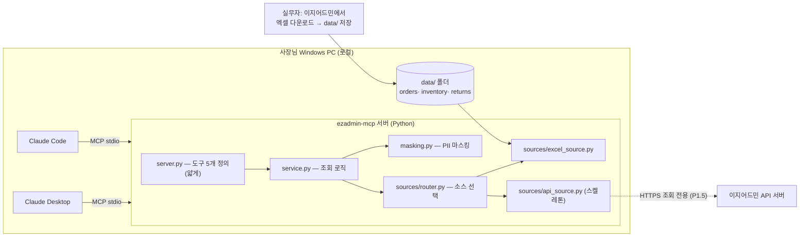

# 01. 아키텍처

## 구성도



## 기술 스택

| 항목 | 선택 | 이유 |
|---|---|---|
| 언어 | Python 3.10+ | 사용자 PC에 `C:\Python314` 설치됨. 컨테이너는 3.11 |
| MCP | 공식 `mcp` SDK의 FastMCP, **stdio 전송** | 로컬 Claude Desktop/Code 연결 표준 |
| 엑셀 | `openpyxl` (read_only 모드) | xlsx 읽기 전용. pandas 등 무거운 의존성 배제 |
| 의존성 | `mcp`, `openpyxl` 2개만 | 비개발자 PC 설치 실패 지점 최소화. `.env` 파서·HTTP는 표준 라이브러리로 자작 |

## 모듈 구성과 책임

| 파일 | 책임 |
|---|---|
| `server.py` | FastMCP 인스턴스, `@mcp.tool()` 5개 정의. 타입힌트+한국어 docstring만 있고 로직은 전부 service로 위임 |
| `ezmcp/service.py` | 도구 5개의 실제 로직. 필터링·집계·정렬·limit·meta 조립·마스킹 적용. **MCP와 무관하게 단독 호출 가능**(selftest가 직접 호출) |
| `ezmcp/sources/base.py` | 소스 인터페이스: `get_orders()`, `get_inventory()`, `get_returns()` → `(records, source_meta)` |
| `ezmcp/sources/excel_source.py` | data/ 폴더 스캔, 파일 병합, 헤더 매핑, 레코드 정규화 (02 문서) |
| `ezmcp/sources/api_source.py` | 설정 주입형 제네릭 API 클라이언트 (03 문서) |
| `ezmcp/sources/router.py` | source_mode에 따라 소스 선택·폴백 (아래) |
| `ezmcp/normalize.py` | 헤더 후보 매핑표, 상태 버킷, 날짜·금액 파싱 (02 문서) |
| `ezmcp/masking.py` | pii_mode별 마스킹 (06 문서) |
| `ezmcp/brands.py` | 브랜드 매칭 (05 문서) |
| `ezmcp/couriers.py` | 택배사명 → 송장 조회 URL 템플릿 (04 문서) |
| `ezmcp/dates.py` | KST 기준 기간 키워드 해석 (04 문서) |
| `ezmcp/envload.py` | `.env` 파서 (표준 lib만, `os.environ` 기존 값 우선) |
| `ezmcp/config.py` | `config.json` 로드(없으면 example에서 자동 생성), env 오버라이드 |

## 소스 라우팅 규칙

`EZMCP_SOURCE_MODE` (또는 config `source_mode`): `auto` | `excel` | `api`

- `excel`: 엑셀만 사용 (기본값. 실무자가 엑셀을 신뢰하는 경우 고정용)
- `api`: API만 사용. 설정 불완전·호출 실패 시 **폴백하지 않고** 한국어 오류 반환
- `auto`: api 섹션이 완전(enabled + base_url + 인증값 존재)하면 API 시도, 실패하면
  엑셀로 폴백하고 응답 `meta.warnings`에 "API 호출 실패로 엑셀 데이터로 답변: <사유>" 명시

## 모든 응답에 붙는 meta 블록 (신뢰성 원칙)

어떤 도구든 응답 최상위에 `meta`를 포함한다. Claude가 답변할 때 데이터 기준 시점을
말할 수 있게 하기 위함이며, 오래된 엑셀로 잘못 답하는 사고를 막는 핵심 장치다.

```json
"meta": {
  "source": "excel",
  "files": [{"파일": "주문_0727.xlsx", "수정시각": "2026-07-27 09:12", "행수": 1863}],
  "데이터기준": "2026-07-27 09:12",
  "pii_mode": "masked",
  "warnings": ["주문 데이터가 26시간 전 파일입니다. 최신 엑셀을 내려받아 주세요."]
}
```

## 읽기 전용 보장 수단 (설계로 강제)

1. 도구 5개 모두 조회. 상태를 바꾸는 도구·코드 경로 자체가 없음
2. 엑셀은 `load_workbook(read_only=True, data_only=True)`, CSV는 읽기 모드로만 오픈
3. API 클라이언트는 config에 정의된 엔드포인트만 호출 가능하고, 03 문서의 규칙에 따라
   조회 성격 엔드포인트만 등록한다. HTTP 메서드는 GET/POST(조회 파라미터 전달용)만 허용
4. 서버가 만드는 파일 쓰기는 단 두 가지 예외만: 최초 실행 시 `config.json` 자동 생성,
   `data/` 하위 폴더 자동 생성. 그 외 파일 쓰기 금지

## 프로세스·로깅 규칙

- **stdout에 아무것도 출력하지 않는다.** stdio 전송이 오염되어 연결이 조용히 죽는다.
  `print()` 금지, 로깅은 `logging.basicConfig(stream=sys.stderr)`
- 시간대는 항상 KST. `zoneinfo("Asia/Seoul")` 시도 후 실패 시(Windows에서 tzdata 부재)
  `timezone(timedelta(hours=9))` 고정 오프셋으로 폴백 — tzdata를 의존성에 넣지 않는 이유
- **파일 수정시각도 KST로 변환**해서 쓴다(`datetime.fromtimestamp(mtime, tz=kst())`).
  시스템 로컬 시간대를 그대로 쓰면 KST가 아닌 PC에서 신선도 경고가 허위로 뜬다
- 예외는 도구 안에서 잡아 한국어 메시지의 정상 JSON(`{"오류": "..."}` + meta)으로 반환.
  스택트레이스는 stderr 로그로만
